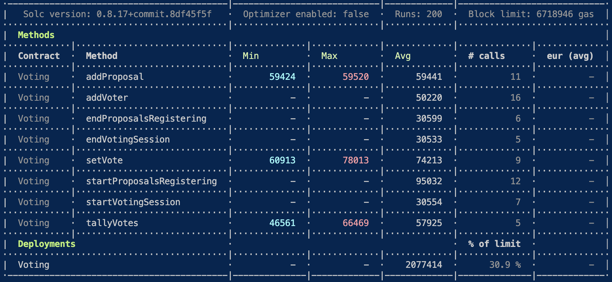

# Testing Smart Contract Voting.sol 

```
This suite of test cases is the complete demonstration 
of simple testing system for Solidity smart 
contracts.
```
##  Testing Structure: 
1.Testing Setter/Getter
2.Testing status of voting session
3.Testing function setVote and function tallyVote
4.Testing all events
5.Testing reverts

```
Contract: Voting
    Testing setter/getter
      ✔ should store voter in mapping structure, retrieve voter (123ms)
      ✔ should init proposal in array structure, retrieve init proposal (140ms)
      ✔ should store proposal in array structure, retrieve proposal (237ms)
    Testing status
      ✔ retrieve proposalsRegistrationStarted status (76ms)
      ✔ retrieve proposalsRegistrationEnded status (71ms)
      ✔ retrieve votingSessionStarted status (52ms)
      ✔ retrieve votingSessionEnded status (195ms)
    Testing setVote and tallyVote 
      ✔ should result proposalId at 2 (466ms)
      ✔ should result proposalId at 0 with no vote done (319ms)
    Testing events
      ✔ should add vote, get VoterRegistered (71ms)
      ✔ should add vote, get VoterRegistered event (251ms)
      ✔ should add vote, get WorkflowStatusChange event (86ms)
      ✔ should add vote, get Voted event (76ms)
    Testing revert
      ✔ should not add an already registered voter, revert (369ms)
      ✔ should not Proposals registration session, revert
      ✔ should not Voters registration session, revert (89ms)
      ✔ should not be an empty proposal, revert
      ✔ should not voting session, revert
      ✔ should not a vote already done, revert (249ms)
      ✔ should not a proposal not found, revert (55ms)
      ✔ should not an non voting session ended, revert (41ms)
      ✔ should not be a wining proposalId number 2, revert (175ms)

  22 passing (5s)
```

##  How to run the test ?  
On truffle project with ganache blockchain
```
cd [your-project]
npm install --save-dev @openzeppelin/test-helpers 
truffle test test/voting.test.js
```


##  How to test with eth-gas-reporter ?  
```
cd [your-project]
npm install --save-dev eth-gas-reporter
```

Go to truffle-config.js and insert :
```
mocha: {  
    reporter: 'eth-gas-reporter',
    reporterOptions : { 
      gasPrice:1,
      token:'ETH',
      showTimeSpent: true,
    }  
  },
```

Resulat after npm test :

